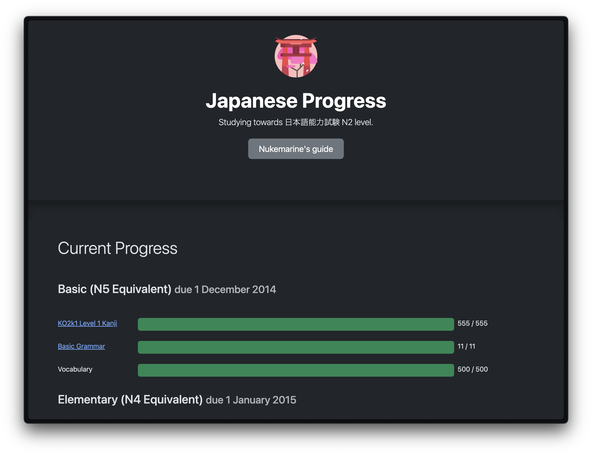

# 🇯🇵 Japanese Progression

A simple PHP application that displays Japanese language learning progress.

[](https://github.com/maccath/japanese-progression/actions)
[](https://php.net)
[](https://getcomposer.org)

## Requirements
- [PHP ^8.2](https://www.php.net/releases/8.2/)
- [Composer](https://getcomposer.org)

## Installation

```shell
composer install
```

## Usage

To run the application locally, use the PHP built-in development server.

```shell
php -S localhost:8000
```

The application will be available at [http://localhost:8000](http://localhost:8000/)

<div style="text-align: center;">
    
</div>

## Unit Tests

Tests are written using PHPUnit and stored under app/tests.

```shell
./vendor/bin/phpunit app/tests
```
